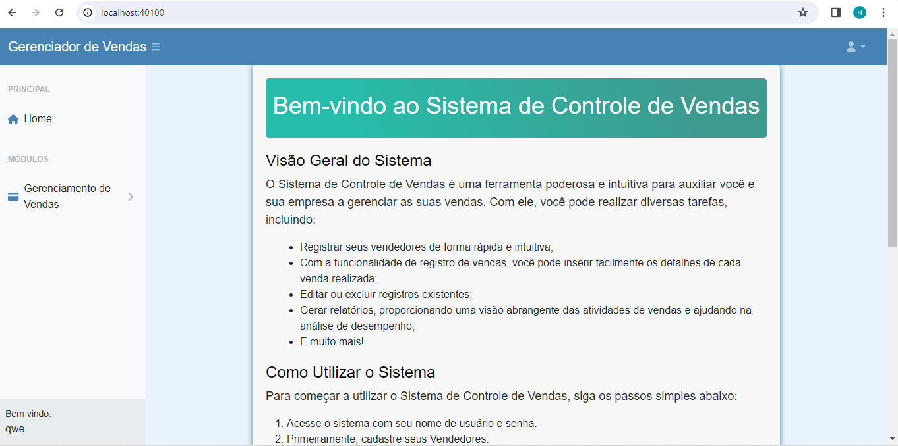

# Trabalho Prático 2 - Desenvolvimento Web III

## Grupo

- Hiago Henrique Tofanelli
- Vinicius Bertoldi Motta

## Pontuação Atual

Pontuação atual do grupo: 10 pontos

## Entrega e Avaliação

- Forma de Entrega: Postar no AVA o link do repositório remoto no GitHub.
- Forma de Avaliação: Seminário.
- Data da Entrega: [Inserir data disponível no AVA]

## Instruções Gerais

# Instruções Gerais

| Número | Descrição                                                                                                           |
|--------|---------------------------------------------------------------------------------------------------------------------|
| 1      | Todos os grupos começam com 10 pontos e vão perdendo, à medida que não implementam o que é solicitado.               |
| 2      | O software desenvolvido deve seguir a arquitetura Cliente-Servidor vista nas aulas da disciplina.                      |
| 3      | Criar um repositório no GitHub e efetuar push de todo o código para ele, não esquecer do .gitignore.                 |
| 4      | Não utilizar o repositório criado para acompanhar as aulas.                                                          |
| 5      | O aluno pode criar APIs do Back-End em qualquer linguagem de programação.                                           |
| 6      | Os dados devem ficar armazenados em um Servidor de Banco de Dados (SGBD).                                            |
| 7      | É necessário proteger as rotas das APIs com JWT ou outro mecanismo de token semelhante.                              |
| 8      | É necessário fazer login para entrar no sistema.                                                                     |
| 9      | O layout do Front-End pode utilizar o template de administração disponibilizado em sala de aula ou ser personalizado. |
| 10     | O Front-End, em hipótese alguma, pode fazer acesso direto ao SGBD.                                                     |
| 11     | Este trabalho não terá continuação.                                                                                 |

## Apresentação do Seminário

### Estudo de Caso

O aluno deverá implementar um conjunto de APIs e uma interface gráfica para realizar o CRUD referente a duas tabelas que se relacionam do tipo 1:N, cuja escolha do módulo ficará a cargo do grupo. A tabela escolhida não pode ser do módulo financeiro feito no trabalho anterior. Todas as tabelas devem ter pelo menos os campos ID, Removido, um campo do tipo texto, um campo do tipo data e um campo do tipo decimal. Uma das tabelas obrigatoriamente deve ter uma chave estrangeira referenciando a outra tabela.

### Regras de Negócio

Um programador está implementando um determinado módulo para o sistema ERP. Para cada uma das tabelas, deve-se implementar 5 operações de CRUD de acordo com as realizadas em atividades anteriores e vistas em sala de aula. As operações devem ser realizadas no formato de APIs:

| Operação   | Descrição                                                                                                           |
|------------|---------------------------------------------------------------------------------------------------------------------|
| GetAllXXX  | Retorna todos os campos da tabela que não foram apagados, ou seja, aqueles cujo campo 'removido' seja igual a false. |
| GetXXXByID | Retorna todos os campos da tabela de acordo com o ID informado, trazendo somente o registro que não foi apagado, isto é, aquele cujo campo 'removido' seja igual a false. |
| InsertXXX  | Insere um novo registro na tabela.                                                                                  |
| UpdateXXX  | Atualiza um registro na tabela de acordo com o ID informado.                                                         |
| DeleteXXX  | Efetua um soft delete em um registro na tabela de acordo com o ID informado. O registro não é apagado fisicamente, apenas o campo 'removido' é passado para true. |
### Front-End

- Para cada API do back-end, deve ser criada uma respectiva função no front-end que usará a API.
- Deverá haver controle de sessão de usuário logado.

## Avaliação do Trabalho

### Sobre o Repositório Remoto

O grupo perderá a pontuação normalizada indicada na questão.

1. (5,0 pontos) Não postar no Moodle o link do trabalho repositório remoto.

### Sobre o Software

O grupo perderá a pontuação normalizada indicada na questão.

1. (10 pontos) Criar as 05 APIs para cada tabela no back-end de acordo com as orientações definidas na seção regras de negócio.
2. (06 pontos) Criar as 05 funções para cada tabela no front-end referentes às APIs.
3. (04 pontos) Criar a tela de login.
4. (02 pontos) Criar controle de sessão.
5. (04 pontos) Criar mecanismo de segurança JWT ou semelhante.
6. (07 pontos) Criar repositório no GitHub.

### Sobre o Seminário

- Apresentação até 15 minutos.
- Forma de avaliação: Serão descontados os seguintes pontos:
  - Passar o tempo limite: 0,2 ponto por minuto a mais.
  - Vestimenta inapropriada: chinelo de dedo, bermuda, camiseta cavada. Perde 3,0 pontos.
